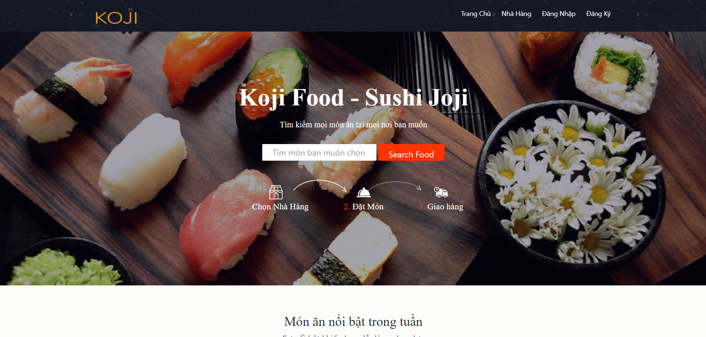
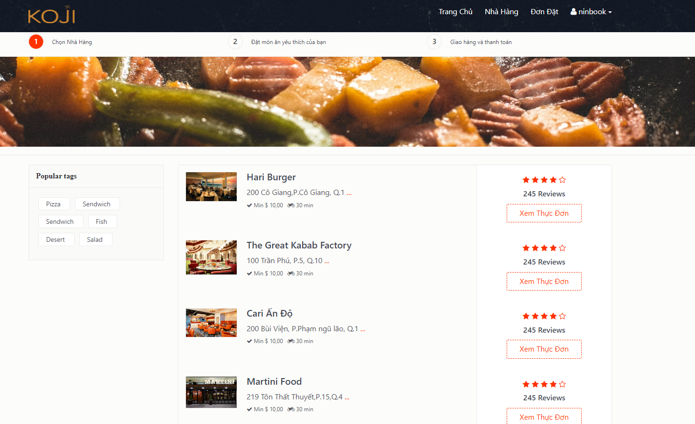
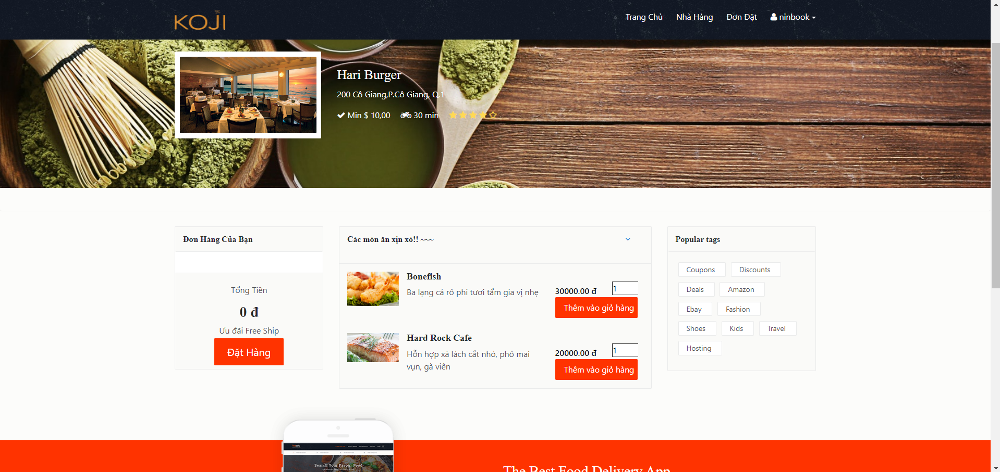
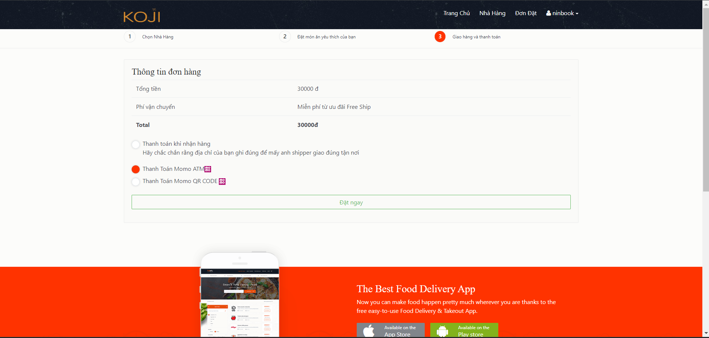
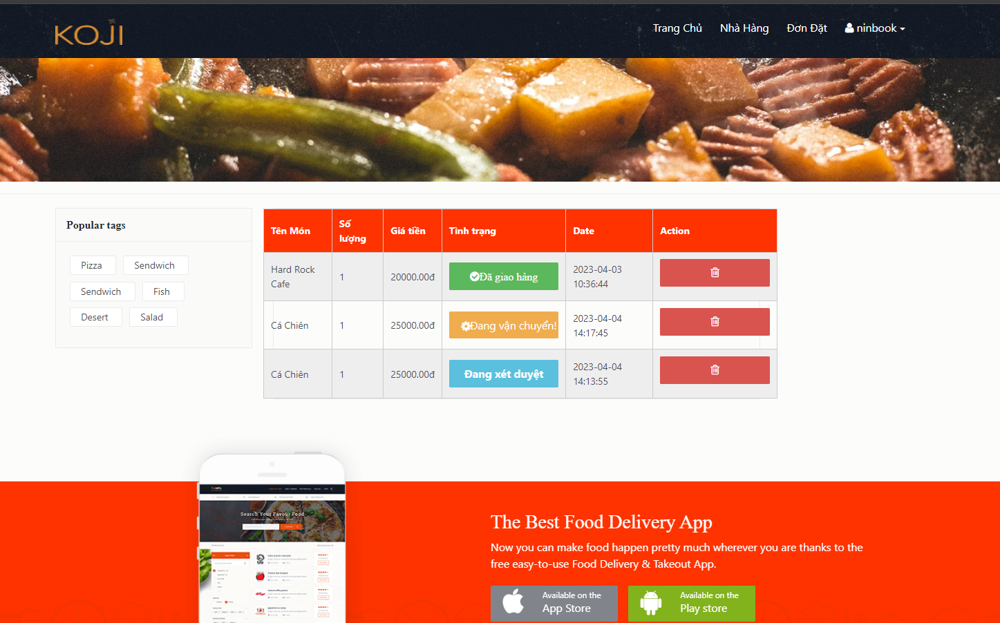
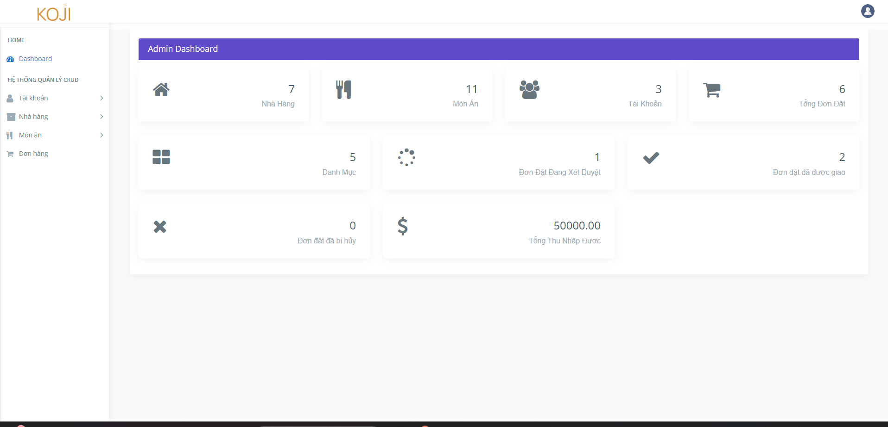
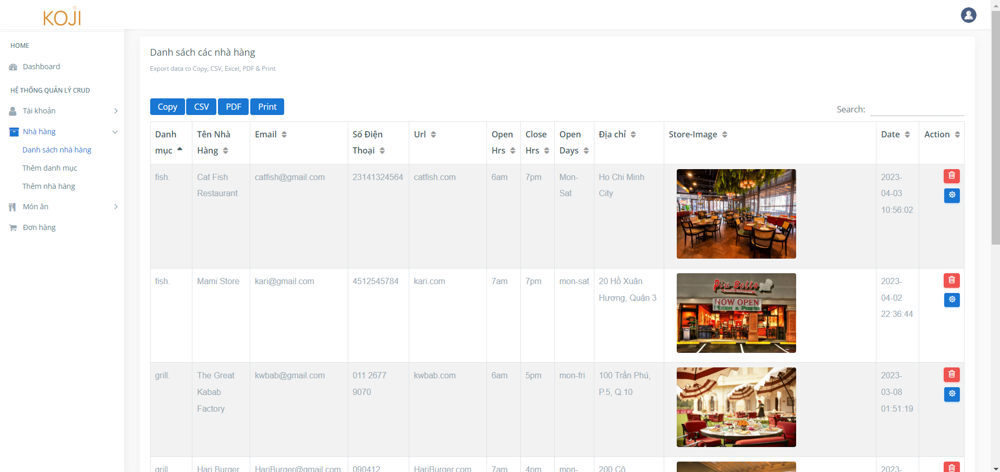
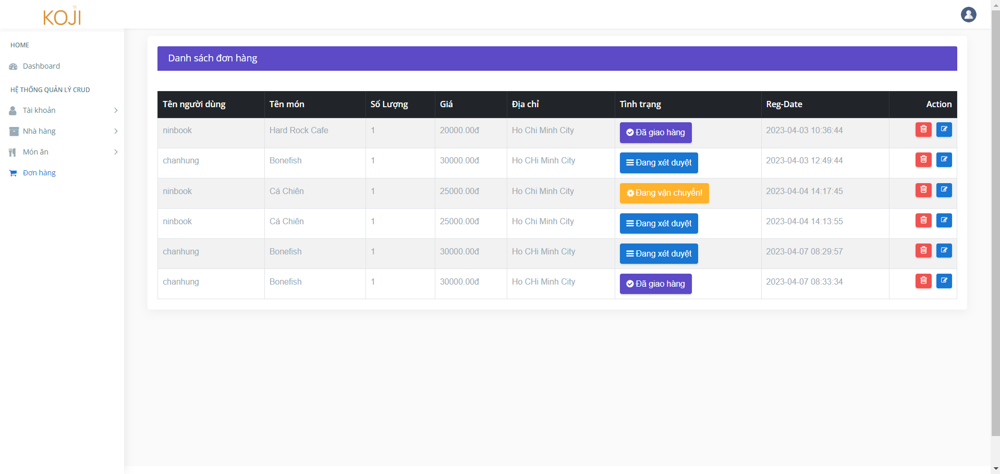
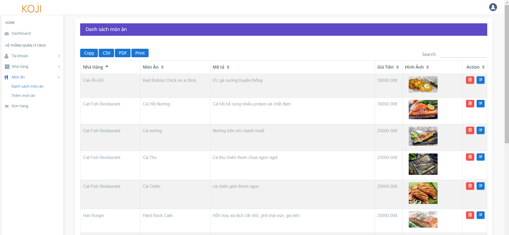

# Koji Food
An Order Food website that allows customers to purchase food in
the services through an online platform. Customers can shop from the comfort of
their own homes, without having to physically visit a store

##
##
##

##
## 
##
##

## Technologies
PHP with HTML,CSS,Javascript with some database in MySQL connected with XAMMP

## Screenshots

### Main page

 

 

 

 

 

### Admin Dashboard

 

 

 

 

## License

### *TEAM PIXEL*:

Stt | Mã sinh viên | Tên
---- | ---- | ---
1 | 1911065247 | [Trần Chấn Hưng](https://www.facebook.com/chanhung.ninzy/)
2 | 1911160680 | [Ngô Nguyễn Ngọc Thành](https://www.facebook.com/dong.ngo.77770/)
3 | 1911065880 | [Lê Hoàng Minh Tuấn](https://www.facebook.com/cuabequyen/)
